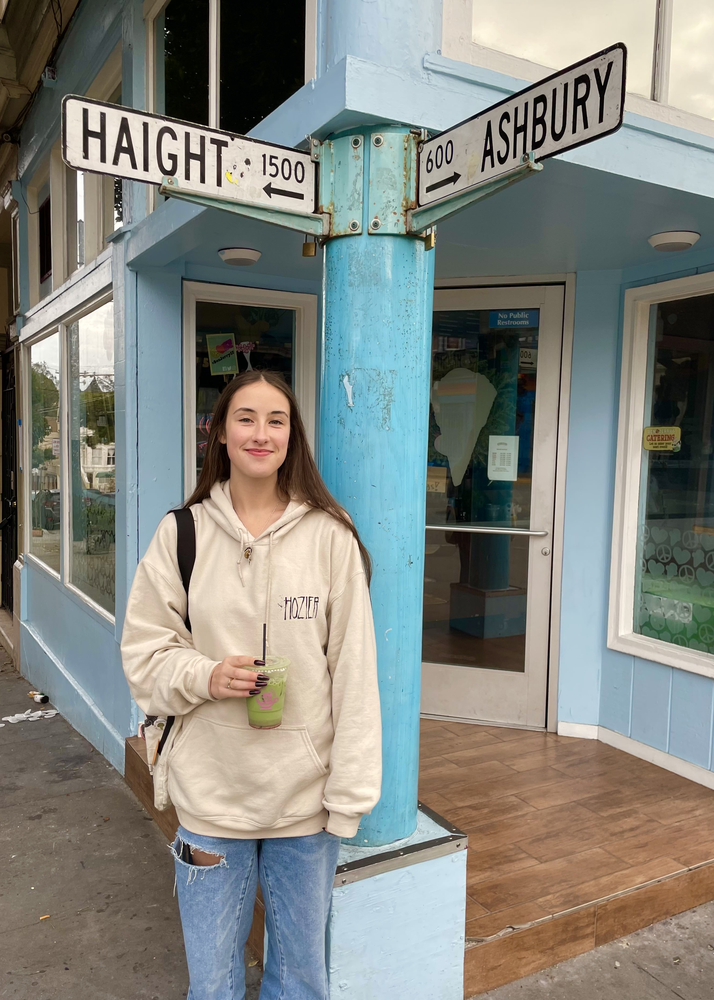
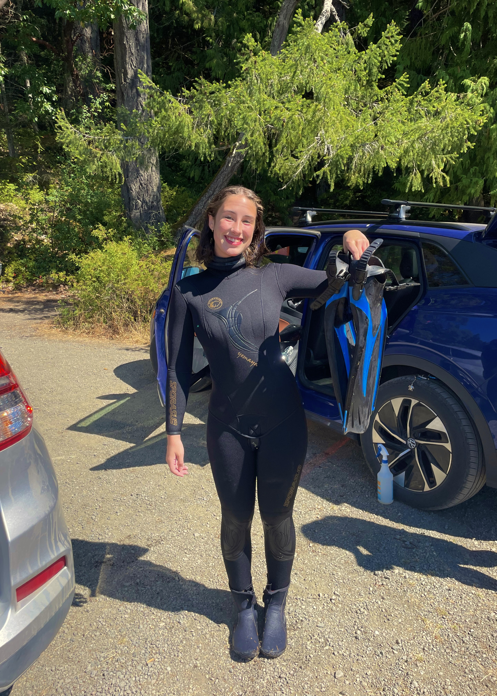
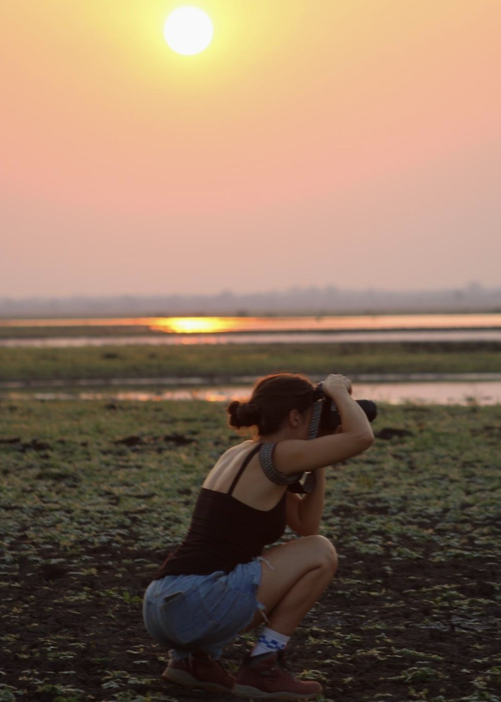
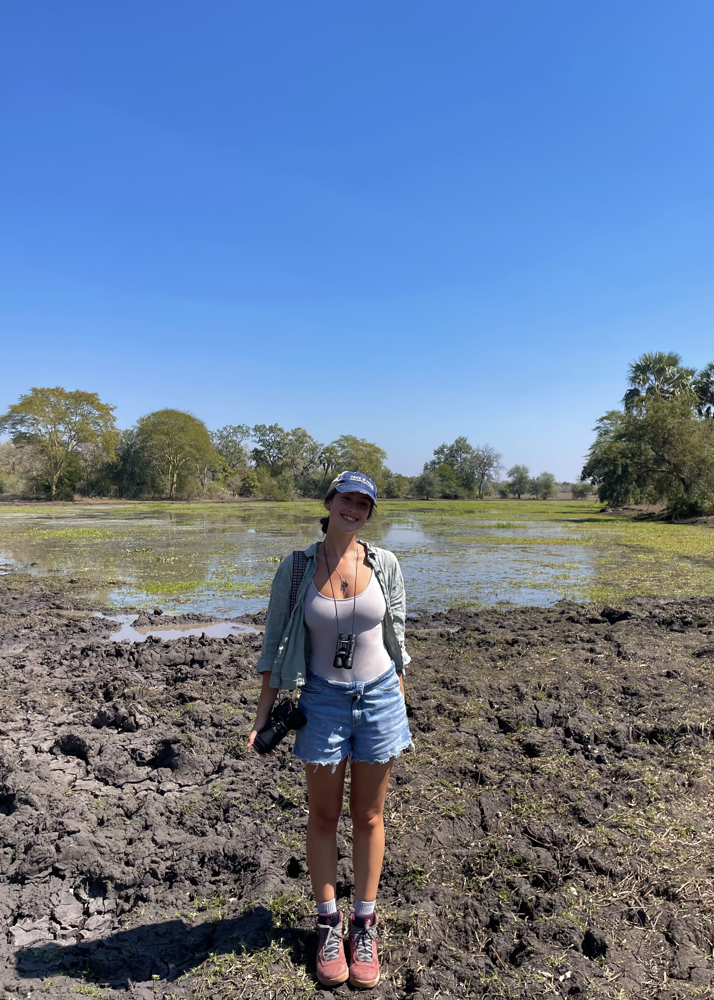
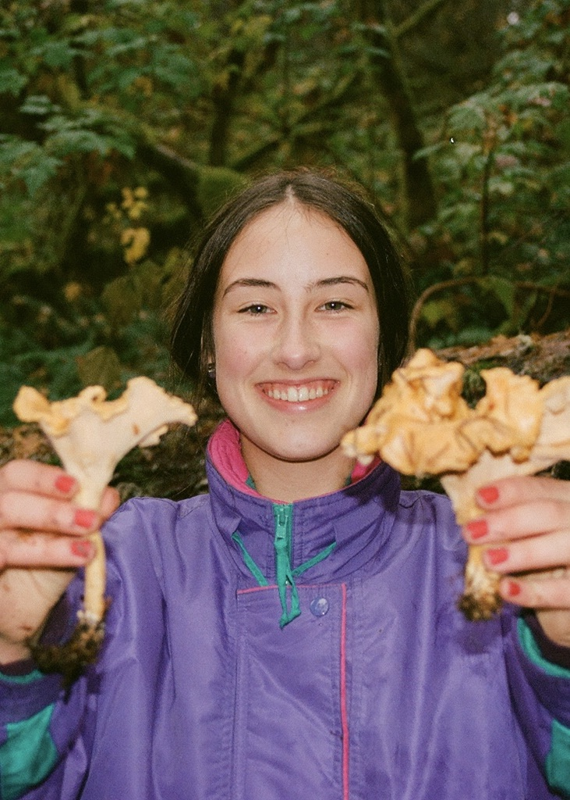

Welcome! This website is a place for me to practice my R skills and talk about things that I enjoy while doing so. Consider it a living document—I'll be adding to it as I learn and go!

A little bit about me—I'm from Silverdale, WA, but I grew up right outside Portland, OR. I LOVE music (Haight-Ashbury was a long awaited bucket-list stop!) and I'll go to any live show that I can get to. Free time usually means something outdoorsy (diving, snowboarding, foraging), out with my camera, or experimenting with a new syrup combination for my matcha lattes. I also love to watch movies, read, and travel when I get the chance—the past few years have taken me to Hawaii, Mozambique, and more. Below is a bit about my journey at Oregon State and where I'm headed next!

## Oregon State
<div style="margin-top: -1em;">
I came into Oregon State as a declared marine biology major, but in my time here I've taken photography courses, line dancing, and more. I fell in love with statistics after I took my first course my junior year; and I immediately looked into a double major. However, I soon realized that while OSU has the only dedicated statistics program in Oregon, it doesn't offer an undergraduate major—just a minor and graduate program. I declared a minor in statistics and am hoping to earn my master's after I finish my B.S. this summer. Along with my schoolwork, I've enjoyed being a learning assistant for the statistics department. I love working directly with students to facilitate better learning in the classroom, especially in regards to a topic that I'm so passionate about.
</div>

## Looking to the future
<div style="margin-top: -1em;">
In the next year, I hope to be accepted to a master's program in statistics, where I can continue developing my data science skills and strengthening my theoretical foundations. I'm excited to see where the journey takes me!
</div>

```{=html}
<style>
  .about-entity img.about-image { display: none; }
  #myCarousel .carousel-item img {
    height: 500px;
    object-fit: cover;
  }
  .about-entity {
    flex: 0 0 50% !important;
  }
</style>
<script>
  document.addEventListener("DOMContentLoaded", function() {
    var carousel = document.getElementById("myCarousel");
    var subtitle = document.querySelector(".subtitle");
    if (carousel && subtitle) {
      subtitle.parentNode.insertBefore(carousel, subtitle);
    }
  });
</script>
<div id="myCarousel" class="carousel carousel-fade" data-bs-ride="carousel">
  <div class="carousel-inner">
    <div class="carousel-item active">
      
    </div>
    <div class="carousel-item">
      
    </div>
    <div class="carousel-item">
      
    </div>
    <div class="carousel-item">
      
    </div>
    <div class="carousel-item">
      
    </div>
    <div class="carousel-item">
      
    </div>
  </div>
  <button class="carousel-control-prev" type="button" data-bs-target="#myCarousel" data-bs-slide="prev">
    <span class="carousel-control-prev-icon"></span>
  </button>
  <button class="carousel-control-next" type="button" data-bs-target="#myCarousel" data-bs-slide="next">
    <span class="carousel-control-next-icon"></span>
  </button>
</div>
```