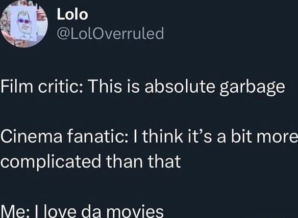
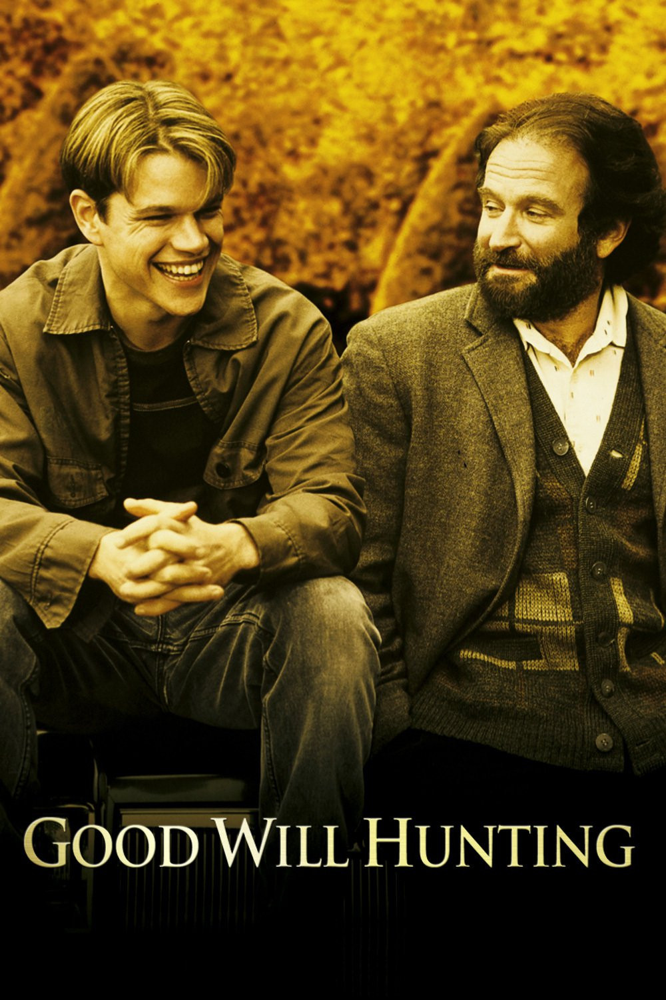
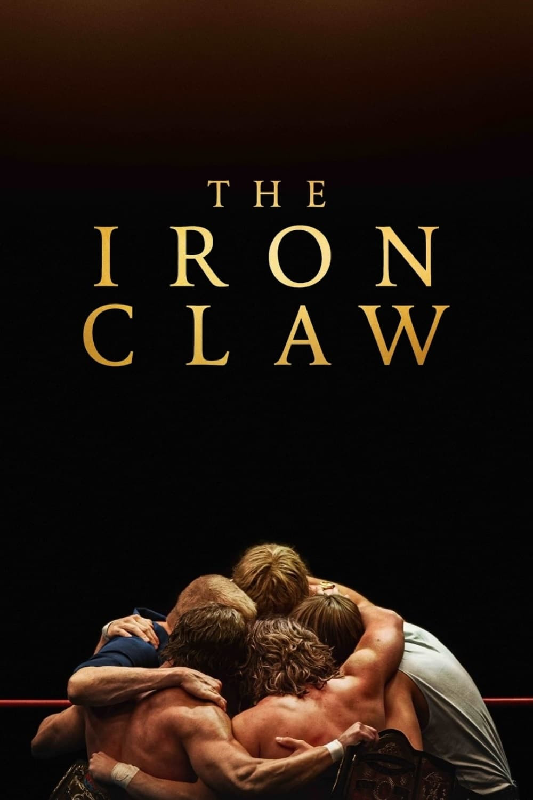

```{=html}
<style>
.listing-category {
  display: none !important;
}
.quarto-category-count {
  display: none !important;
}
.quarto-listing-category-title {
  visibility: hidden;
  position: relative;
}
.quarto-listing-category-title::after {
  content: "Rankings";
  visibility: visible;
  position: absolute;
  left: 0;
}
</style>
```

I love movies! I've uploaded my Letterboxd activity to practice using the blog function, but you can find my actual Letterboxd account <a href="https://letterboxd.com/finleydb/" target="_blank">here</a>.

{width="300px"}

My ratings are purely instinctual and based on vibes.

## Favorite films
::: {layout="[25,25,25,25]"}





:::

## Recent Activity